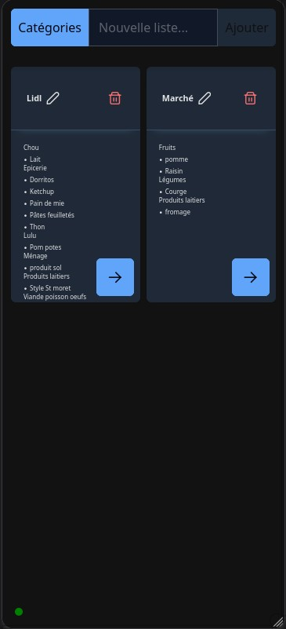
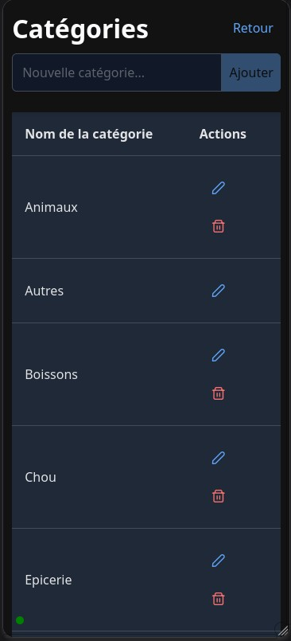
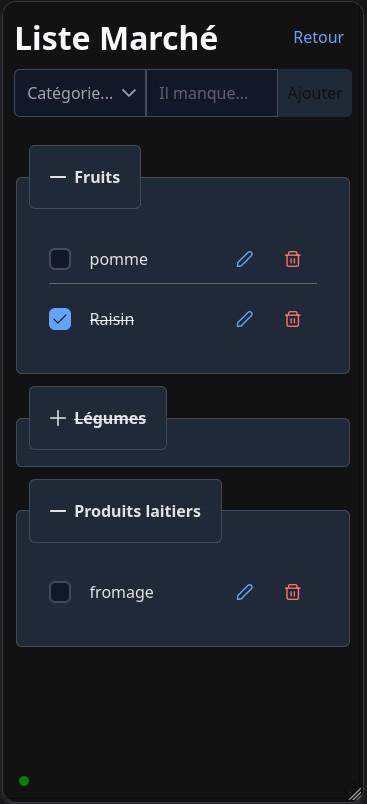

# Shared Shopping Lists
This app aims at providing shared items lists between any number of users.
While it was designed for shopping lists at first, it can be used for any types of lists.

## Technical design
This app has two main parts :
* An angular frontend, acting as a (primarily mobile) web interface.
* A java backend with a database that stores the data

## Features
### Share any number of lists


### Custom categories


### Categorize items, then check them when done


### Real-time synchronization
When an item is added/modified/checked/deleted by a client, any other active client will show the change instantly

## Installation
### Requirements
* A server machine (any computer that stays powered on and can be accessed through the internet), any OS will do
* [Optional] A hostname bound to your server for easy access
* A web server such as Apache2 or nginx for the frontend.
* Java 21 runtime environment (JRE)
* Postgresql database

### Step-by-step
#### Database
* Install Postgresql then log in as a database admin (platform-dependant, see corresponding guides for your OS/distribution)
* Create a database user dedicated to the shoppingList app: `CREATE USER shoppingList WITH PASSWORD '<YOUR_PASSWORD>';`
* Create a dedicated database: `CREATE DATABASE shoppingList OWNER shoppingList;`
* Leave the database empty. It will be populated automatically when you first launch the app.

Note: username and database name may be customized to your liking.
#### Backend
* Install a java 21 runtime environment (JRE)
* Download the latest release's .jar package and place it in a dedicated directory on your server
* Create a fille named `application.yaml` with content:
```yaml
spring:
  liquibase:
    change-log: db/changelog/db.changelog-master.xml
  datasource:
    url: jdbc:postgresql://localhost/shoppinglist
    username: shoppingList
    password: <your-password>
server:
  port: 8090
  servlet:
    context-path: /api
  error:
    include-message: always
```
* Customize the database name, username and password
* [Optional] Customize the server port
* Launch the app: `java -jar "shoppingList-2.0.0.jar"`
* If the app started properly, the last log line should look like: `Started ShoppingListApplication in 2.557 seconds (process running for 2.917)`
* Configure the app as a service in a way that suits your platform

#### Frontend
* Install a web server, for instance Apache2 or nginx.
* Enable proxy and websocket proxy modules on the web server
* Create a vhost on the web server with two reverse-proxy routes. These will allow the frontend to access the backend through the web server.
  * `/api/ws` => `ws://localhost:8091/api/ws`
  * `/api` => `http://localhost:8091/api`
  * Note: don't forget to customize the server port if you changed it when installing the backend.

Example configuration for Apache2:
```
<VirtualHost *:80>
    ServerName your.domain.name.com
    DocumentRoot /srv/http/shopping-list
    
    ProxyPass /api/ws ws://localhost:8091/api/ws
    ProxyPassReverse /api/ws ws://localhost:8091/api/ws
    
    ProxyPass /api http://localhost:8091/api
    ProxyPassReverse /api http://localhost:8091/api
</VirtualHost>
```
* Download the latest release's .tar.gz package
* Extract the package at the vhost's root
* Open a browser and navigate to your server's address to see if everything works.
* Optional: Configure SSL with letsencrypt/certbot or any other SSL certificate in your possession.